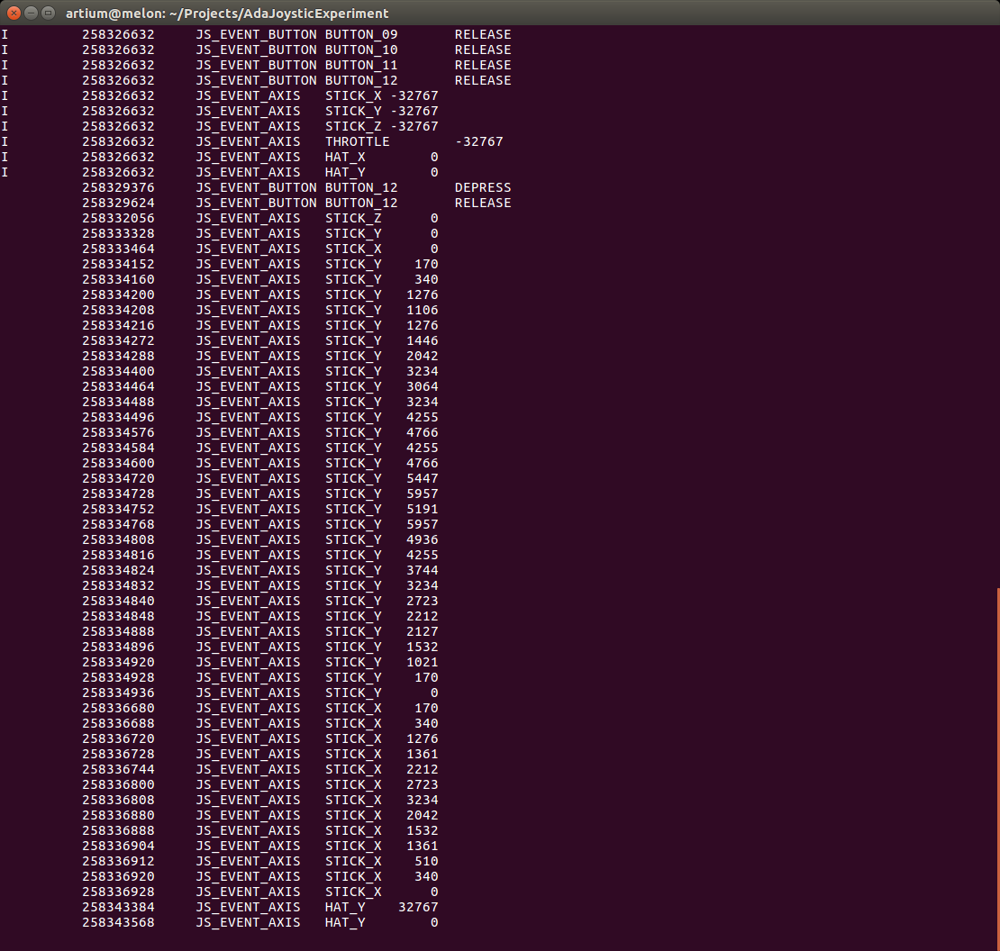

# Ada Joystick

Thick bindings for [Linux joystick driver](https://www.kernel.org/doc/Documentation/input/joystick-api.txt).

## Using

Instantiate `Linux_Joystick` package with two generic type parameters. 
The first type, `Axis_Type` should represent the available axes of the specific joystick and the second type, `Button_Type` should represent buttons.

It is possible to use any scalar, as long as it is limited by 8 bits. For example

```Ada
   type Common_Axis_Type   is range 0..20;
   type Common_Button_Type is range 0..20;
   package LJS is new Linux_Joystick(Button_Type => Common_Button_Type,
                                     Axis_Type   => Common_Axis_Type);
```

### Logitech Extreme 3D Pro

```Ada

   type Logiteck_Extreme_3D_Pro_Axis_Type is
      (STICK_X, STICK_Y, STICK_Z, THROTTLE, HAT_X, HAT_Y);

   type Logiteck_Extreme_3D_Pro_Button_Type is 
      (BUTTON_01, BUTTON_02, BUTTON_03, BUTTON_04,
       BUTTON_05, BUTTON_06, BUTTON_07, BUTTON_08,
       BUTTON_09, BUTTON_10, BUTTON_11, BUTTON_12);   
   
   package L3D is new Linux_Joystick(Button_Type => Logiteck_Extreme_3D_Pro_Button_Type,
                                     Axis_Type   => Logiteck_Extreme_3D_Pro_Axis_Type);

```

## Example

A _main.adb_ file is provided with an example of how to use the bindings.

### Build the example

```bash
gprbuild -Pada_joystick.gpr --create-missing-dirs
```

### Run the example

```bash
./bin/main
```



